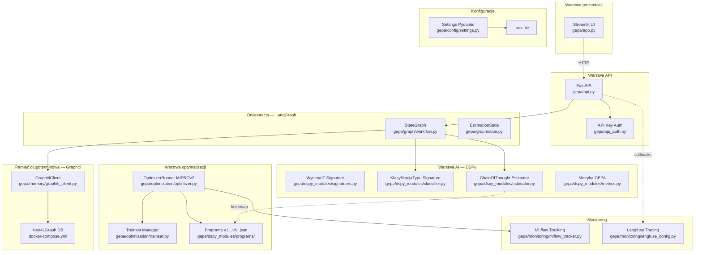
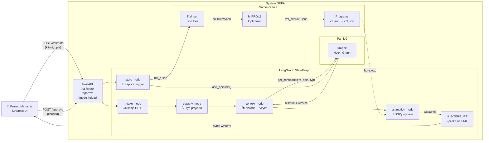
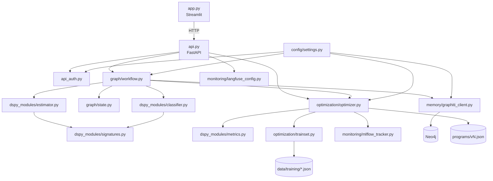
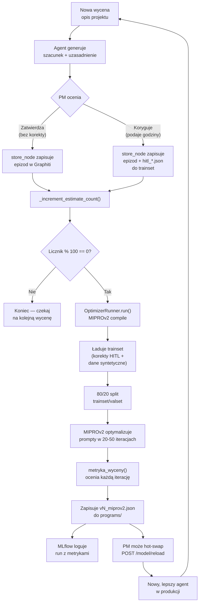
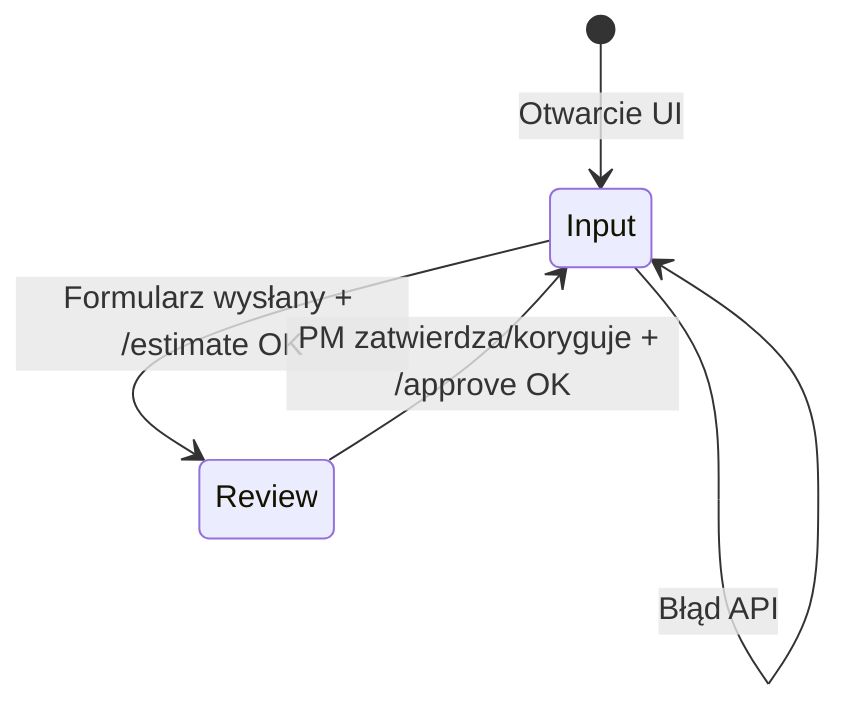

# GEPA — Samouczący Agent Wyceny Projektów IT

> **GEPA** (Generative Estimation with Prompt Adaptation) to system sztucznej inteligencji, który uczy się wyceniać projekty IT na podstawie historycznych danych i korekt ekspertów. Każda poprawka PM-a sprawia, że agent staje się dokładniejszy.

---

## Spis treści

1. [Cel i koncepcja biznesowa](#1-cel-i-koncepcja-biznesowa)
2. [Stos technologiczny](#2-stos-technologiczny)
3. [Architektura systemu](#3-architektura-systemu)
4. [Przepływ wyceny — sekwencja biznesowa](#4-przepływ-wyceny--sekwencja-biznesowa)
5. [Pętla samouczenia](#5-pętla-samouczenia)
6. [Jak działa DSPy i MIPROv2](#6-jak-działa-dspy-i-miprov2)
7. [Jak działa Graphiti — pamięć długoterminowa](#7-jak-działa-graphiti--pamięć-długoterminowa)
8. [Jak działa LangGraph — orkiestracja](#8-jak-działa-langgraph--orkiestracja)
9. [Metryka GEPA](#9-metryka-gepa)
10. [Klasyfikacja typów projektów](#10-klasyfikacja-typów-projektów)
11. [Moduły systemu](#11-moduły-systemu)
12. [Konfiguracja (.env)](#12-konfiguracja-env)
13. [Uruchomienie krok po kroku](#13-uruchomienie-krok-po-kroku)
14. [API Reference](#14-api-reference)
15. [Streamlit UI](#15-streamlit-ui)
16. [Monitoring — MLflow i Langfuse](#16-monitoring--mlflow-i-langfuse)
17. [Struktura katalogów](#17-struktura-katalogów)
18. [Roadmapa technologiczna](#18-roadmapa-technologiczna)

---

## 1. Cel i koncepcja biznesowa

### Problem

Wycena projektów IT to jedno z najtrudniejszych zadań w zarządzaniu projektami. PM-owie opierają się na intuicji, analogiach do poprzednich projektów i własnym doświadczeniu. Efektem są estymacje rozbieżne o 50–200% z rzeczywistością, co prowadzi do przekroczenia budżetów i terminów.

### Rozwiązanie

GEPA to agent AI, który:

1. **Pamięta** historię wszystkich projektów klienta (Graphiti — temporal knowledge graph)
2. **Klasyfikuje** typ projektu (legacy / nowy / AI / migracja) i dobiera właściwy kontekst
3. **Szacuje** roboczogodziny na podstawie opisu projektu i historycznych wzorców
4. **Uczy się** z każdej korekty PM-a — po 100 wycenach automatycznie optymalizuje swoje prompty
5. **Wyjaśnia** każdą wycenę z podziałem na komponenty i podaje poziom pewności

### Mierzalna wartość

| Metryka | Cel |
|---------|-----|
| Szacunki w zakresie ±25% rzeczywistych | 80% (po Fazie 2) |
| Szacunki w zakresie ±20% rzeczywistych | 85% (po Fazie 3+) |
| Czas generowania wyceny | < 30 sekund |

---

## 2. Stos technologiczny

### Mapa technologii



### Dlaczego te technologie?

#### DSPy 2.6.x
DSPy (Declarative Self-improving Python) to framework Stanford, który traktuje prompty jak **parametry modelu** — zamiast ręcznie pisać prompty, definiujesz **co** chcesz osiągnąć (Signature), a DSPy automatycznie optymalizuje **jak** to osiągnąć. To fundamentalna zmiana paradygmatu: prompt staje się wynikiem optymalizacji, nie ręcznego tuningu.

```python
# Tradycyjne podejście (ręczny prompt):
prompt = """Jesteś ekspertem od wyceny IT. Masz projekt: {opis}.
Historia klienta: {historia}. Podaj godziny w formacie JSON..."""

# DSPy — deklarujesz CZEGO chcesz, nie jak:
class WycenaIT(dspy.Signature):
    """Wycena projektu IT w roboczogodzinach."""
    opis_projektu: str = dspy.InputField(desc="Pełen opis wymagań")
    historia_klienta: str = dspy.InputField(desc="Historia z Graphiti")
    wzorce_ryzyk: str = dspy.InputField(desc="Wyuczone wzorce ryzyk")
    szacunek_godzin: int = dspy.OutputField(desc="Liczba roboczogodzin")
    uzasadnienie: str = dspy.OutputField(desc="Wyjaśnienie metodyki")
    pewnosc: float = dspy.OutputField(desc="Pewność 0.0–1.0")
```

#### MIPROv2 (surrogate dla GEPA)
MIPROv2 (Multi-prompt Instruction Proposal Optimizer v2) to optimizer DSPy, który automatycznie znajdzie najlepsze instrukcje dla każdego pola Signature. Używamy go jako **tymczasowego surogatu** dla GEPA — gdy `dspy.GEPA` wejdzie do biblioteki, podmiana to zmiana jednej linii w `optimizer.py`.

```python
# Aktualna implementacja (MIPROv2):
optimizer = MIPROv2(metric=metryka_wyceny, auto="light", num_threads=1)

# Podmiana na GEPA gdy dostępna (1 linia!):
optimizer = GEPA(metric=metryka_wyceny_z_feedbackiem, ...)
```

#### LangGraph
LangGraph pozwala modelować przepływ agenta jako **graf stanów** z węzłami (nodes) i krawędziami (edges). Kluczowa funkcja: `interrupt_before=["store"]` — graf zatrzymuje się przed zapisem, czekając na zatwierdzenie PM-a (Human-in-the-Loop).

#### Graphiti (Zep OSS)
Graphiti to **temporalny graf wiedzy** — nie tylko przechowuje fakty, ale śledzi *kiedy* były prawdziwe. Dla wyceny IT to kluczowe: „Klient X w 2023 miał projekt backend 200h, ale w 2024 zmienił stack na microservices i projekty wzrosły do 400h." Neo4j jako backend.

#### LiteLLM
Generyczny proxy dla modeli językowych — jeden interfejs do Claude, GPT-4, Gemini, Mistral. Konfiguracja przez zmienne środowiskowe, zero zmian w kodzie przy zmianie dostawcy.

#### MLflow
Śledzenie eksperymentów ML — każda optymalizacja (MIPROv2 run) jest logowana z parametrami, metrykami i artefaktem (plik .json z programem).

#### Langfuse
Distributed tracing dla wywołań LLM — widać każde wywołanie API, czas odpowiedzi, tokeny, cost. Opt-in: działa tylko gdy klucze w `.env`.

---

## 3. Architektura systemu

### Diagram wysokopoziomowy



### Diagram modułów (zależności)



---

## 4. Przepływ wyceny — sekwencja biznesowa

```mermaid
sequenceDiagram
    actor PM as 👤 PM / Analityk
    participant UI as Streamlit UI
    participant API as FastAPI
    participant LG as LangGraph
    participant CLF as classify_node
    participant CTX as context_node
    participant EST as estimation_node
    participant GR as Graphiti (Neo4j)
    participant STORE as store_node
    participant OPT as OptimizerRunner

    PM->>UI: Wpisuje opis projektu + nazwę klienta
    UI->>API: POST /estimate {klient, opis_projektu}
    API->>LG: ainvoke(initial_state)

    Note over LG,CLF: Krok 1 — Klasyfikacja
    LG->>CLF: intake_node → classify_node
    CLF->>CLF: DSPy KlasyfikacjaTypu(opis_projektu)
    CLF-->>LG: typ_projektu = "legacy" | "nowy" | "ai" | "migracja"

    Note over LG,GR: Krok 2 — Kontekst z pamięci
    LG->>CTX: context_node
    CTX->>GR: get_context(klient, opis, typ_projektu)
    GR-->>CTX: historia poprzednich projektów tego klienta
    CTX->>GR: get_risk_patterns(opis_projektu)
    GR-->>CTX: wyuczone wzorce ryzyk

    Note over LG,EST: Krok 3 — Wycena AI
    LG->>EST: estimation_node
    EST->>EST: estimators[typ_projektu](opis, historia, wzorce)
    Note right of EST: DSPy ChainOfThought<br/>wywołuje LLM (Claude/GPT/Gemini)<br/>z zoptymalizowanym promptem
    EST-->>LG: szacunek_godzin, uzasadnienie, pewnosc

    Note over LG,PM: ⏸️ INTERRUPT — czeka na PM
    LG-->>API: wynik wyceny (stan zawieszony)
    API-->>UI: {szacunek_godzin, uzasadnienie, pewnosc, typ_projektu}
    UI-->>PM: Wyświetla wynik

    PM->>PM: Ocenia wycenę
    alt PM zatwierdza
        PM->>UI: Klikam "Zatwierdź"
        UI->>API: POST /approve {session_id, zatwierdzone: true}
    else PM koryguje
        PM->>UI: Wpisuje rzeczywistą liczbę godzin + komentarz
        UI->>API: POST /approve {session_id, korekta_pm: 320, komentarz_pm: "..."}
    end

    Note over LG,OPT: Krok 4 — Zapis i samouczenie
    API->>LG: aupdate_state + ainvoke (wznowienie)
    LG->>STORE: store_node
    STORE->>GR: add_episode(session_id, treść z typem projektu)
    Note right of GR: Graphiti zapamiętuje<br/>projekt jako węzeł grafu<br/>z timestampem
    opt PM podał korektę
        STORE->>STORE: _save_to_trainset() → hitl_*.json
    end
    STORE->>STORE: _increment_estimate_count()
    opt Licznik % 100 == 0
        STORE->>OPT: runner.run(student, training_dir)
        OPT->>OPT: MIPROv2 optymalizuje prompty
        OPT-->>STORE: vN_miprov2.json (nowy program)
        Note right of OPT: Program zapisany na dysk<br/>dostępny do hot-swap
    end
    STORE-->>API: {zatwierdzone: True}
    API-->>UI: {status: "saved"}
    UI-->>PM: "Wycena zapisana w pamięci agenta"
```

---

## 5. Pętla samouczenia

System uczy się w dwóch trybach: **pasywny** (zbiera dane) i **aktywny** (optymalizuje).



### Co to jest trainset?

Trainset to zbiór przykładów w formacie JSON, każdy z opisem projektu i rzeczywistymi godzinami:

```json
{
  "opis_projektu": "Portal B2B dla firmy logistycznej: integracja z 3 systemami ERP, moduł zamówień, dashboard analityczny.",
  "rzeczywiste_godziny": 840,
  "typ_projektu": "nowy",
  "historia_klienta": "Klient zrealizował już 2 projekty webowe, oba opóźnione o 20%.",
  "wzorce_ryzyk": "Integracje ERP historycznie 2x dłuższe niż planowano.",
  "komentarz_pm": "Zbyt optymistycznie — brak czasu na testy E2E.",
  "zrodlo": "hitl"
}
```

Trainset zbierany jest z trzech źródeł:
1. **Migracja z ace-poc** — dane historyczne z poprzedniego systemu
2. **Generator syntetyczny** (`gepa/data/generate_synthetic.py`) — 50+ przykładów na start
3. **Korekty HITL** — każda poprawka PM-a to nowy, cenny przykład

---

## 6. Jak działa DSPy i MIPROv2

### Problem z tradycyjnym prompt engineeringiem

Wyobraź sobie, że chcesz nauczyć model dobrze wyceniać projekty IT. Ręcznie piszesz prompt:

```
"Jesteś ekspertem od wyceny IT w Orange Polska. Biorąc pod uwagę opis projektu
i historię klienta, oszacuj roboczogodziny. Weź pod uwagę ryzyko..."
```

Czy ten prompt jest optymalny? Nie wiesz. Może lepiej byłoby napisać:
```
"Jako senior PM z 10-letnim doświadczeniem w telekomunikacji, przeanalizuj..."
```

DSPy rozwiązuje ten problem: **nie piszesz promptu — definiujesz zadanie, a DSPy sam znajdzie optymalny prompt**.

### Jak DSPy buduje prompt z Signature

Gdy wywołujesz `estimator(opis_projektu=..., historia_klienta=..., wzorce_ryzyk=...)`, DSPy automatycznie buduje prompt w stylu:

```
Wycena projektu IT w roboczogodzinach na podstawie opisu i historii.

---

Opis projektu: Portal B2B dla firmy logistycznej z integracją ERP...
Historia klienta: Klient zrealizował 2 projekty webowe, oba opóźnione...
Wzorce ryzyk: Integracje historycznie 2x dłuższe...

---

Reasoning: Let's think step by step...
Szacunek godzin:
Uzasadnienie:
Pewnosc:
```

Pole `desc=` w `InputField`/`OutputField` staje się fragmentem instrukcji. Klasa `ChainOfThought` dodaje pole `Reasoning` (chain-of-thought), co dramatycznie poprawia jakość.

### MIPROv2 — optymalizacja promptów

MIPROv2 działa jak hiperparametryczny tuning, ale dla promptów:

```
Iteracja 1: Próbuje prompt A → metryka = 0.72
Iteracja 2: Próbuje prompt B ("Jako ekspert od legacy systems...") → metryka = 0.68
Iteracja 3: Próbuje prompt C ("Uwzględnij 25% bufor na ryzyko...") → metryka = 0.81
...
Iteracja 20: Najlepszy prompt → zapisuje do vN_miprov2.json
```

**Metryka** (`metryka_wyceny`) ocenia jakość wyceny:
- 50% — dokładność (`|szacunek - rzeczywiste| / rzeczywiste`)
- 30% — uzasadnienie (długość jako proxy jakości)
- 20% — kalibracja pewności (kara za skrajności: >0.95 lub <0.2)

```python
# Przykład działania metryki:
gold.rzeczywiste_godziny = 400
pred.szacunek_godzin = 420    # błąd 5% → dokładność 0.95
pred.uzasadnienie = "Backend 200h, frontend 120h, testy 80h, PM 20h."  # 60 znaków
pred.pewnosc = 0.75            # w normie → kalibracja 1.0

score = 0.5 * 0.95 + 0.3 * min(1.0, 60/150) + 0.2 * 1.0
#     = 0.475 + 0.12 + 0.20 = 0.795
```

### GEPA-ready interface

Gdy `dspy.GEPA` wejdzie do biblioteki DSPy (planowane), podmiana to **jedna linia**:

```python
# gepa/optimization/optimizer.py — aktualne:
optimizer = MIPROv2(
    metric=metryka_wyceny,    # zwraca float
    auto="light",
    num_threads=1,
)

# Po podmiance na GEPA:
optimizer = GEPA(
    metric=metryka_wyceny_z_feedbackiem,  # zwraca (float, str) — tekstowy feedback
    auto="light",
    num_threads=1,
)
```

GEPA (Generative Evaluation and Prompt Adaptation) używa tekstowego feedbacku zamiast samej liczby, co pozwala modelowi rozumieć *dlaczego* wycena była zła, a nie tylko *że* była zła.

---

## 7. Jak działa Graphiti — pamięć długoterminowa

### Problem z klasyczną bazą danych

Prosta baza danych przechowuje: "Klient Orange, projekt Portal, 400h". Ale:
- Kiedy ten projekt był realizowany?
- Jak zmieniała się technologia klienta w czasie?
- Które wzorce ryzyk dotyczą projektów AI vs legacy?

Relacyjna baza danych nie odpowie dobrze na pytanie "jaka jest historia klienta X, uwzględniając że ostatnio przeszedł na microservices?"

### Temporalny graf wiedzy

Graphiti przechowuje fakty jako **węzły** i **krawędzie** grafu, każda z timestampem. Gdy dodajesz nowy epizod, Graphiti automatycznie:
1. Wyodrębnia encje (klient, projekt, technologia)
2. Tworzy relacje między nimi
3. Śledzi zmiany w czasie (fakt A był prawdziwy w 2023, fakt B zastąpił go w 2024)

```python
# Dodajemy epizod po każdej wycenie:
await graphiti.add_episode(
    name="session_abc123",
    episode_body="""
        Projekt: Portal B2B z integracją SAP
        Typ: migracja
        Klient: Orange Polska
        Szacunek agenta: 600 godz.
        Rzeczywiste (PM): 840 godz.
        Komentarz PM: Integracja SAP zajęła 3x więcej czasu.
    """,
    source_description="estimation_agent",
    reference_time=datetime.now(tz=timezone.utc),
)
```

### Wyszukiwanie z typem projektu

```python
# Zapytanie semantyczne uwzględniające typ projektu:
results = await graphiti.search(
    "historia projektów legacy klienta Orange Polska: modernizacja systemu bilingowego"
)
# Zwraca EntityEdge objects z .fact = tekst faktu z grafu
# np. "Orange Polska zrealizowała projekt legacy billing w 2022, zajął 1200h, opóźniony o 30%"
```

Dzięki typowi projektu w zapytaniu, Graphiti faworyzuje historyczne projekty tego samego rodzaju — legacy system dla legacy projektu, AI projekty dla AI projektu.

---

## 8. Jak działa LangGraph — orkiestracja

### Graf stanów

LangGraph modeluje przepływ agenta jako **maszynę stanów**. Każdy węzeł to asynchroniczna funkcja, która przyjmuje stan i zwraca aktualizację stanu:

```python
# Węzeł klasyfikacji:
async def classify_node(state: EstimationState) -> dict:
    result = classifier(opis_projektu=state["opis_projektu"])
    return {"typ_projektu": normalize_type(result.typ_projektu)}
    # Zwraca TYLKO zmiany — reszta stanu niezmieniona
```

### Stan jako TypedDict

```python
class EstimationState(TypedDict):
    session_id: str          # UUID sesji (= thread_id LangGraph)
    klient: str              # Nazwa klienta
    opis_projektu: str       # Opis wymagań
    typ_projektu: str        # "legacy" | "nowy" | "ai" | "migracja"
    historia_klienta: str    # Z Graphiti
    wzorce_ryzyk: str        # Z Graphiti
    szacunek_godzin: int | None
    uzasadnienie: str | None
    pewnosc: float | None
    korekta_pm: int | None   # Wypełniane przez PM po INTERRUPT
    komentarz_pm: str | None
    zatwierdzone: bool
```

### HITL — Human in the Loop

Kluczowy mechanizm: `interrupt_before=["store"]` zatrzymuje graf przed węzłem `store_node`. Graf "zamarza" z checkpointem w pamięci (MemorySaver). PM widzi wynik, może go zmienić, a po `approve` graf jest wznawiany:

```
Przepływ:
intake → classify → context → estimation → ⏸️ STOP ← PM ocenia
                                                          ↓
                                         store ← PM zatwierdza/koryguje
```

```python
# API — uruchomienie grafu (zatrzymuje się przed store):
result = await _graph.ainvoke(initial_state, config)

# API — wznowienie po decyzji PM:
await _graph.aupdate_state(config, {"korekta_pm": 840, "komentarz_pm": "..."})
await _graph.ainvoke(None, config)  # None = wznów z punktu zawieszenia
```

### Checkpointing

Każdy thread (sesja) ma własny checkpoint w `MemorySaver`. Oznacza to, że jednocześnie można obsługiwać wiele niezależnych sesji wyceny — każda PM-a w osobnym wątku, z własnym stanem.

---

## 9. Metryka GEPA

Metryka to serce systemu samouczenia. Każda wycena jest oceniana przez `metryka_wyceny()`:

```python
def metryka_wyceny(gold, pred, trace=None) -> float:
    # gold.rzeczywiste_godziny — rzeczywistość (z trainset lub korekty PM)
    # pred.szacunek_godzin — co agent przewidział

    # Składowa 1: Dokładność (waga 50%)
    blad = abs(pred.szacunek_godzin - gold.rzeczywiste_godziny) / gold.rzeczywiste_godziny
    dokladnosc = max(0.0, 1.0 - blad)
    # Przykład: szacunek 420 vs rzeczywiste 400 → błąd 5% → dokładność 0.95

    # Składowa 2: Uzasadnienie (waga 30%)
    # Długość jako proxy jakości — minimum 150 znaków = pełne uzasadnienie
    uzasadnienie_score = min(1.0, len(pred.uzasadnienie) / 150)

    # Składowa 3: Kalibracja pewności (waga 20%)
    # Penalizuje skrajności: pewność 0.99 lub 0.01 jest nieuzasadniona
    if 0.3 <= pred.pewnosc <= 0.85:
        kalibracja = 1.0   # w normie
    elif pred.pewnosc < 0.2 or pred.pewnosc > 0.95:
        kalibracja = 0.3   # skrajność — kara
    else:
        kalibracja = 0.7   # pogranicze

    return round(0.5 * dokladnosc + 0.3 * uzasadnienie_score + 0.2 * kalibracja, 4)
```

### Tekstowy feedback (dla przyszłego GEPA)

```python
score, feedback = metryka_wyceny_z_feedbackiem(gold, pred)
# feedback = "Szacunek za niski o 40% — uwzględnij bufor na ryzyko i testy."
# lub: "Uzasadnienie zbyt krótkie — dodaj podział na komponenty (backend/frontend/testy)."
# lub: "Zbyt wysoka pewność — dla nowych projektów trzymaj pewność poniżej 0.9."
```

Tekstowy feedback pozwoli przyszłemu GEPA rozumieć błędy semantycznie, a nie tylko liczbowo.

---

## 10. Klasyfikacja typów projektów

System automatycznie klasyfikuje każdy projekt do jednej z 4 kategorii:

| Typ | Opis | Charakterystyka wyceny |
|-----|------|----------------------|
| `legacy` | Modernizacja/utrzymanie starego systemu | Wysokie ryzyko niespodzianek, często +50% do estymacji |
| `nowy` | Nowy system od zera | Standardowe ryzyko, baseline estimator |
| `ai` | Projekt z ML/AI/LLM | Eksperymentalny charakter, trudna estymacja, niska pewność |
| `migracja` | Przeniesienie do chmury/nowej platformy | Zależy od jakości dokumentacji starego systemu |

```python
class KlasyfikacjaTypu(dspy.Signature):
    """Sklasyfikuj typ projektu IT na podstawie jego opisu."""
    opis_projektu: str = dspy.InputField(desc="Opis projektu IT")
    typ_projektu: str = dspy.OutputField(
        desc="Typ projektu — JEDNO słowo: legacy / nowy / ai / migracja"
    )

# Użycie:
classifier = dspy.ChainOfThought(KlasyfikacjaTypu)
result = classifier(opis_projektu="Integracja nowego modelu LLM z CRM")
normalize_type(result.typ_projektu)  # → "ai"
```

Każdy typ ma własny DSPy estimator w słowniku `estimators`:

```python
estimators = {
    "legacy": dspy.ChainOfThought(WycenaIT),  # może być osobno skompilowany
    "nowy":   dspy.ChainOfThought(WycenaIT),  # baseline
    "ai":     dspy.ChainOfThought(WycenaIT),  # wymaga danych o AI projektach
    "migracja": dspy.ChainOfThought(WycenaIT),
}
```

Przy wystarczającej liczbie przykładów per typ, każdy może być optymalizowany niezależnie przez MIPROv2.

---

## 11. Moduły systemu

### `gepa/dspy_modules/`

| Plik | Zawartość | Rola |
|------|-----------|------|
| `signatures.py` | `WycenaIT` | Kontrakt wejście/wyjście dla wyceny |
| `classifier.py` | `KlasyfikacjaTypu`, `normalize_type()` | Wykrywa typ projektu |
| `estimator.py` | `create_estimator()` | Fabryka ChainOfThought |
| `metrics.py` | `metryka_wyceny()`, `metryka_wyceny_z_feedbackiem()` | Ocena jakości wyceny |
| `programs/` | `v1_baseline.json`, `v2_miprov2.json` ... | Skompilowane programy DSPy |

### `gepa/graph/`

| Plik | Zawartość | Rola |
|------|-----------|------|
| `state.py` | `EstimationState` TypedDict | Definicja stanu grafu |
| `workflow.py` | `create_graph()`, 5 węzłów, `_save_to_trainset()`, `_increment_estimate_count()` | Cały przepływ LangGraph |

### `gepa/memory/`

| Plik | Zawartość | Rola |
|------|-----------|------|
| `graphiti_client.py` | `GraphitiClient` | Wrapper dla Graphiti API |
| `schemas.py` | Schematy encji | Modele domenowe dla grafu |

### `gepa/optimization/`

| Plik | Zawartość | Rola |
|------|-----------|------|
| `optimizer.py` | `OptimizerRunner` | Orchestruje MIPROv2, wersjonuje programy |
| `trainset.py` | `load_trainset()`, `count_examples()` | Ładuje przykłady treningowe |

### `gepa/monitoring/`

| Plik | Zawartość | Rola |
|------|-----------|------|
| `mlflow_tracker.py` | `OptimizationTracker` | Loguje runy optymalizacji do MLflow |
| `langfuse_config.py` | `configure_langfuse()` | Konfiguruje tracing LLM (opt-in) |

### `gepa/data/`

| Plik | Zawartość | Rola |
|------|-----------|------|
| `generate_synthetic.py` | Generator danych | Tworzy 50+ syntetycznych przykładów wyceny |
| `migrate_ace_poc.py` | Migracja danych | Importuje dane z poprzedniego systemu |
| `training/` | `*.json` files | Przykłady treningowe |

---

## 12. Konfiguracja (.env)

Utwórz plik `.env` w katalogu głównym projektu:

```dotenv
# ─── LLM — wybierz jednego dostawcę ──────────────────────────────────────────

# Claude (Anthropic) — zalecany
LLM_MODEL=anthropic/claude-3-5-haiku-20241022
LLM_API_KEY=sk-ant-...

# GPT-4o (OpenAI)
# LLM_MODEL=openai/gpt-4o-mini
# LLM_API_KEY=sk-...

# Gemini (Google)
# LLM_MODEL=gemini/gemini-1.5-flash
# LLM_API_KEY=AIza...

# Lokalny model przez LM Studio / Ollama
# LLM_MODEL=openai/llama-3.1-8b
# LLM_API_BASE=http://localhost:1234/v1
# LLM_API_KEY=local

# ─── Neo4j / Graphiti ─────────────────────────────────────────────────────────
GRAPHITI_NEO4J_URI=bolt://localhost:7687
GRAPHITI_NEO4J_USER=neo4j
GRAPHITI_NEO4J_PASSWORD=password  # musi być >= 8 znaków

# ─── Optymalizacja ────────────────────────────────────────────────────────────
GEPA_TRIGGER_THRESHOLD=50          # próg dla should_trigger() (ręczne uruchomienie)
GEPA_TRIGGER_EVERY=100             # auto-trigger co N wycen
TRAINING_DIR=gepa/data/training    # katalog z plikami JSON trainset
ESTIMATES_FILE=gepa/data/estimates_count.json

# ─── MLflow ──────────────────────────────────────────────────────────────────
MLFLOW_TRACKING_URI=mlruns         # lokalny folder lub URL serwera MLflow

# ─── Langfuse (opcjonalne — tracing LLM) ─────────────────────────────────────
# Jeśli puste — Langfuse jest wyłączony
LANGFUSE_PUBLIC_KEY=
LANGFUSE_SECRET_KEY=

# ─── API Authentication (opcjonalne) ─────────────────────────────────────────
# Jeśli puste — API jest otwarte (tryb deweloperski)
# Jeśli ustawione — POST /estimate, /approve, /model/reload wymagają nagłówka X-API-Key
API_KEY=
```

### Zmienne środowiskowe systemu (alternatywa do .env)

```bash
export LLM_MODEL=anthropic/claude-3-5-haiku-20241022
export LLM_API_KEY=sk-ant-...
export GRAPHITI_NEO4J_PASSWORD=password
```

---

## 13. Uruchomienie krok po kroku

### Wymagania systemowe

- Python 3.12+
- Docker Desktop (dla Neo4j)
- 4 GB RAM (Neo4j + LLM calls)

### Krok 1: Sklonuj i zainstaluj

```bash
git clone https://github.com/your-org/gepa.git
cd gepa
python -m venv .venv
source .venv/bin/activate  # Windows: .venv\Scripts\activate
pip install -e ".[dev]"
```

### Krok 2: Uruchom Neo4j (Graphiti backend)

```bash
docker-compose up -d
```

Sprawdź czy działa: otwórz http://localhost:7474 w przeglądarce.
- Login: `neo4j`
- Hasło: `password` (z `docker-compose.yml`)

### Krok 3: Skonfiguruj .env

```bash
cp .env.example .env   # jeśli istnieje, lub utwórz ręcznie
# Edytuj .env — ustaw LLM_MODEL i LLM_API_KEY
```

### Krok 4: Wygeneruj dane syntetyczne (pierwsze uruchomienie)

```bash
.venv/bin/python gepa/data/generate_synthetic.py
# Tworzy ~50 przykładów w gepa/data/training/synthetic_*.json
```

Opcjonalnie — migruj dane z ace-poc:

```bash
.venv/bin/python gepa/data/migrate_ace_poc.py --source /path/to/ace-poc/data/training/
```

### Krok 5: Uruchom API

```bash
.venv/bin/uvicorn gepa.api:app --reload --port 8000
```

Sprawdź: http://localhost:8000/docs — interaktywna dokumentacja Swagger.

### Krok 6: Uruchom Streamlit UI

W osobnym terminalu:

```bash
.venv/bin/streamlit run gepa/app.py --server.port 8501
```

Otwórz: http://localhost:8501

### Krok 7 (opcjonalnie): Uruchom MLflow UI

```bash
.venv/bin/mlflow ui --port 5000
```

Otwórz: http://localhost:5000 — widok eksperymentów optymalizacji.

### Weryfikacja instalacji

```bash
.venv/bin/pytest tests/ -v
# Oczekiwane: 62 passed, 1 warning
```

### Uruchomienie bez Neo4j (tryb mock)

Jeśli nie chcesz uruchamiać Neo4j na dev:

```bash
# GraphitiClient gracefully zwraca puste stringi gdy Neo4j niedostępny
# Agent działa bez historii — wycenia na podstawie samego opisu
```

---

## 14. API Reference

Swagger UI dostępny pod: http://localhost:8000/docs

### POST `/estimate`

Uruchamia wycenę projektu. Graf zatrzymuje się przed zapisem (HITL).

**Request:**
```json
{
  "klient": "Orange Polska",
  "opis_projektu": "Portal self-service dla klientów B2B: zarządzanie umowami, fakturami, zleceniami serwisowymi. Stack: React + FastAPI + PostgreSQL."
}
```

**Response:**
```json
{
  "session_id": "3f8a7c12-...",
  "szacunek_godzin": 680,
  "uzasadnienie": "Frontend React: 200h (dashboard, formularze umów, historia faktur). Backend FastAPI: 180h (REST API, auth, integracja z CRM). Baza danych: 80h (schemat, migracje, indeksy). Testy: 120h (unit 60h + E2E 60h). Wdrożenie i CI/CD: 60h. Bufor PM: 40h.",
  "pewnosc": 0.72,
  "typ_projektu": "nowy"
}
```

### POST `/approve`

Zatwierdza lub koryguje wycenę i wznawia graf (store_node).

**Request — zatwierdzenie:**
```json
{
  "session_id": "3f8a7c12-...",
  "zatwierdzone": true,
  "korekta_pm": null,
  "komentarz_pm": null
}
```

**Request — korekta:**
```json
{
  "session_id": "3f8a7c12-...",
  "zatwierdzone": true,
  "korekta_pm": 840,
  "komentarz_pm": "Zaniżono czas na integrację z systemem bilingowym i testy bezpieczeństwa."
}
```

**Response:**
```json
{
  "status": "saved",
  "session_id": "3f8a7c12-..."
}
```

### GET `/model/info`

Informacja o aktualnie załadowanym programie DSPy.

**Response:**
```json
{
  "program_version": "v3_miprov2",
  "program_path": "gepa/dspy_modules/programs/v3_miprov2.json"
}
```

Jeśli nie ma jeszcze skompilowanego programu:
```json
{
  "program_version": "baseline",
  "program_path": null
}
```

### POST `/model/reload`

Hot-swap — ładuje najnowszy skompilowany program bez restartu API.

**Headers (jeśli API_KEY skonfigurowany):**
```
X-API-Key: your-secret-key
```

**Response — sukces:**
```json
{
  "status": "reloaded",
  "program": "v3_miprov2"
}
```

**Response — brak programu:**
```json
{
  "status": "no_program",
  "message": "Brak zoptymalizowanego programu."
}
```

---

## 15. Streamlit UI

### Zakładka "Wycena projektu"



1. **Formularz wyceny** — pola: Nazwa klienta, Opis projektu (textarea)
2. **Wyniki wyceny** — 4 metryki: Szacunek (godz.), Pewność, Typ projektu, Sesja
3. **Uzasadnienie** — szczegółowy opis metodyki w niebieskim bloku
4. **Ocena PM** — radio: Zatwierdź / Koryguj
   - Przy "Koryguj": pole liczbowe (rzeczywiste godziny) + komentarz

### Zakładka "Dashboard"

1. **Wersja programu** — aktualny model DSPy (baseline lub vN_miprov2)
2. **Przycisk hot-swap** — "Załaduj najnowszy program" → POST /model/reload
3. **Instrukcja ręcznej optymalizacji** — kod bash do uruchomienia MIPROv2

---

## 16. Monitoring — MLflow i Langfuse

### MLflow — śledzenie optymalizacji

Każde uruchomienie MIPROv2 loguje:

```
Eksperyment: gepa_optimization
  └─ Run: 2026-04-28 14:32:05
       ├─ Parametry:
       │   ├─ optimizer: MIPROv2
       │   └─ num_examples: 127
       ├─ Metryki:
       │   └─ val_score: 0.847
       └─ Artefakty:
           └─ v3_miprov2.json (8.2 KB)
```

Uruchom UI: `mlflow ui --port 5000` → http://localhost:5000

Porównuj kolejne wersje programu i śledź czy metryka rośnie w czasie.

### Langfuse — tracing wywołań LLM

Gdy `LANGFUSE_PUBLIC_KEY` i `LANGFUSE_SECRET_KEY` są ustawione:

```
Trace: session_3f8a7c12
  ├─ classify_node
  │   └─ LLM call: "Sklasyfikuj typ projektu..."
  │       ├─ Input tokens: 245
  │       ├─ Output tokens: 12
  │       ├─ Latency: 0.8s
  │       └─ Cost: $0.0002
  └─ estimation_node
      └─ LLM call: "Wycena projektu IT..."
          ├─ Input tokens: 892
          ├─ Output tokens: 387
          ├─ Latency: 3.2s
          └─ Cost: $0.0015
```

Dzięki temu widać które wywołania są najkosztowniejsze i gdzie są wąskie gardła latency.

---

## 17. Struktura katalogów

```
gepa/
├── api.py                          # FastAPI: /estimate, /approve, /model/*
├── api_auth.py                     # X-API-Key dependency (opt-in)
├── app.py                          # Streamlit UI (2 zakładki)
│
├── config/
│   └── settings.py                 # Pydantic Settings z SecretStr
│
├── data/
│   ├── generate_synthetic.py       # Generator 50+ przykładów syntetycznych
│   ├── migrate_ace_poc.py          # Migracja danych z ace-poc
│   └── training/                   # *.json — trainset
│       ├── synthetic_001.json
│       ├── ...
│       └── hitl_a3f8c2d1.json      # Korekty PM (auto-generowane)
│
├── dspy_modules/
│   ├── signatures.py               # WycenaIT Signature
│   ├── classifier.py               # KlasyfikacjaTypu + normalize_type()
│   ├── estimator.py                # create_estimator() fabryka
│   ├── metrics.py                  # metryka_wyceny() + feedback
│   └── programs/                   # Skompilowane programy DSPy
│       ├── v1_baseline.json        # (jeśli istnieje)
│       └── v2_miprov2.json         # Po pierwszej optymalizacji
│
├── graph/
│   ├── state.py                    # EstimationState TypedDict
│   └── workflow.py                 # LangGraph: 5 węzłów + HITL
│
├── memory/
│   ├── graphiti_client.py          # GraphitiClient (Neo4j wrapper)
│   └── schemas.py                  # Schematy encji domenowych
│
├── monitoring/
│   ├── mlflow_tracker.py           # OptimizationTracker
│   └── langfuse_config.py          # configure_langfuse() (opt-in)
│
└── optimization/
    ├── optimizer.py                # OptimizerRunner (MIPROv2 + wersjonowanie)
    └── trainset.py                 # load_trainset(), count_examples()

tests/                              # 62 testów, pytest
docs/
├── plans/
│   ├── 2026-04-27-estimation-agent-design.md
│   ├── 2026-04-27-faza1-fundament.md
│   ├── 2026-04-28-faza2-samouczenie.md
│   └── 2026-04-28-faza3-specjalizacja.md
docker-compose.yml                  # Neo4j 5 + APOC plugin
pyproject.toml                      # Zależności projektu
.env                                # Konfiguracja (NIE commituj!)
```

---

## 18. Roadmapa technologiczna

### Ukończone

| Faza | Data | Kluczowe funkcje |
|------|------|-----------------|
| Faza 1 — Fundament | 2026-04-27 | DSPy Signature, LangGraph HITL, Graphiti, FastAPI, Streamlit |
| Faza 2 — Samouczenie | 2026-04-28 | Metryka GEPA, MIPROv2 optimizer, MLflow, Langfuse, hot-swap |
| Faza 3 — Specjalizacja | 2026-04-28 | Klasyfikacja typów, per-type estimators, API auth, counter-trigger |

### Planowane

#### Faza 4 — Produkcja
- Per-type optimization pipeline (osobny OptimizerRunner dla każdego z 4 typów)
- A/B evaluation: porównanie wersji programów na żywym ruchu
- REST API dokumentacja OpenAPI + klient SDK
- Gunicorn multi-worker deployment

#### Podmiana na GEPA (gdy dostępna w DSPy)
```python
# gepa/optimization/optimizer.py — zmiana 1 linii:
optimizer = GEPA(
    metric=metryka_wyceny_z_feedbackiem,  # (float, str) zamiast float
    auto="light",
    num_threads=1,
)
```

#### Rozszerzenia Graphiti
- Wzorce ryzyk jako osobne węzły grafu (nie tylko tekst w epizodzie)
- Relacje technologiczne (React ↔ TypeScript ↔ Next.js)
- Automatyczne wykrywanie analogii między projektami

---

## Szybki start dla niecierpliwych

```bash
# 1. Zainstaluj
git clone https://github.com/your-org/gepa.git && cd gepa
python -m venv .venv && source .venv/bin/activate
pip install -e ".[dev]"

# 2. Skonfiguruj
echo "LLM_MODEL=anthropic/claude-3-5-haiku-20241022" > .env
echo "LLM_API_KEY=sk-ant-YOUR_KEY" >> .env
echo "GRAPHITI_NEO4J_PASSWORD=password" >> .env

# 3. Uruchom infrastrukturę
docker-compose up -d

# 4. Generuj dane startowe
.venv/bin/python gepa/data/generate_synthetic.py

# 5. Uruchom
.venv/bin/uvicorn gepa.api:app --reload &
.venv/bin/streamlit run gepa/app.py

# 6. Wejdź na http://localhost:8501 i zacznij wyceniać!
```

---

*Projekt rozwijany przez Adam Dabrowski (AI4IT Lead, Orange Polska)*
*Stack: DSPy 2.6 · LangGraph · Graphiti · Neo4j · FastAPI · Streamlit · MLflow · LiteLLM*
